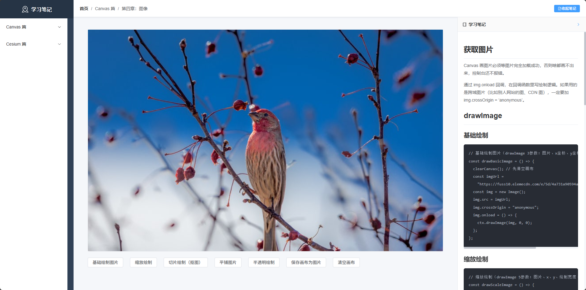
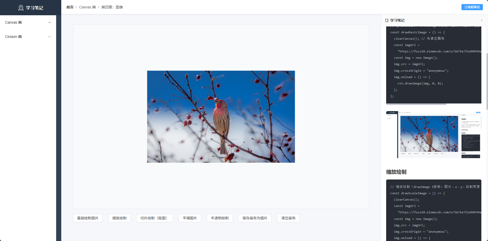
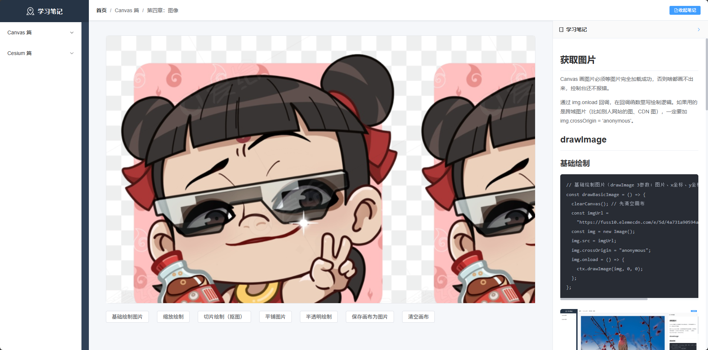
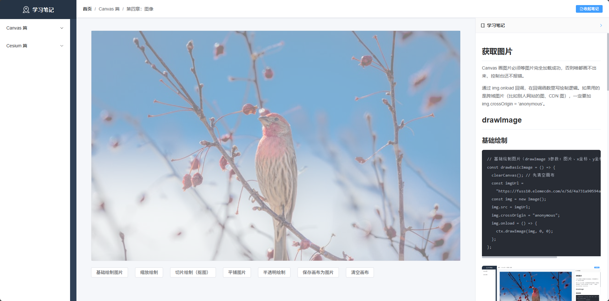

# 获取图片

Canvas 画图片必须等图片完全加载成功，否则啥都画不出来，控制台还不报错。

通过 img.onload 回调，在回调函数里写绘制逻辑。如果用的是跨域图片（比如别人网站的图、CDN 图），一定要加 img.crossOrigin = 'anonymous'。

# drawImage

## 基础绘制

```js
// 基础绘制图片（drawImage 3参数：图片、x坐标、y坐标）
const drawBasicImage = () => {
  clearCanvas(); // 先清空画布
  const imgUrl =
    "https://fuss10.elemecdn.com/e/5d/4a731a90594a4af544c0c25941171jpeg.jpeg";
  const img = new Image();
  img.src = imgUrl;
  img.crossOrigin = "anonymous";
  img.onload = () => {
    ctx.drawImage(img, 0, 0);
  };
};
```



## 缩放绘制

```js
// 缩放绘制（drawImage 5参数：图片、x、y、绘制宽度、绘制高度）
const drawScaleImage = () => {
  clearCanvas();
  const imgUrl =
    "https://fuss10.elemecdn.com/e/5d/4a731a90594a4af544c0c25941171jpeg.jpeg";
  const img = new Image();
  img.src = imgUrl;
  img.crossOrigin = "anonymous";
  img.onload = () => {
    // 原图800x500，缩放到400x250，放在画布中心
    ctx.drawImage(img, 200, 125, 400, 250);
  };
};
```



## 切片绘制

```js
// 切片绘制（抠图，drawImage 9参数：原图裁剪+画布绘制）
const drawSliceImage = () => {
  clearCanvas();
  const imgUrl =
    "https://fuss10.elemecdn.com/e/5d/4a731a90594a4af544c0c25941171jpeg.jpeg";
  const img = new Image();
  img.src = imgUrl;
  img.crossOrigin = "anonymous";
  img.onload = () => {
    // 参数含义：原图sx, sy, 原图裁剪宽高, 画布dx, dy, 画布绘制宽高
    // 从原图(200,100)位置，裁剪400x300的区域，画到画布(0,0)，尺寸不变
    ctx.drawImage(img, 200, 100, 400, 300, 0, 0, 400, 300);
  };
};
```


## 平铺图片

```js
// 平铺图片（用createPattern创建重复图案）
const drawPatternImage = () => {
  clearCanvas();
  const imgUrl =
    "https://fuss10.elemecdn.com/e/5d/4a731a90594a4af544c0c25941171jpeg.jpeg";
  const img = new Image();
  img.src = imgUrl;
  img.crossOrigin = "anonymous";
  img.onload = () => {
    // 创建图案：repeat-重复、repeat-x-水平重复、repeat-y-垂直重复、no-repeat-不重复
    const pattern = ctx.createPattern(img, "repeat");
    ctx.fillStyle = pattern;
    // 用图案填充整个画布
    ctx.fillRect(0, 0, canvasRef.value.width, canvasRef.value.height);
  };
};
```

./

## 半透明

```js
// 半透明绘制（调整全局透明度）
const drawAlphaImage = () => {
  clearCanvas();
  const imgUrl =
    "https://fuss10.elemecdn.com/e/5d/4a731a90594a4af544c0c25941171jpeg.jpeg";
  const img = new Image();
  img.src = imgUrl;
  img.crossOrigin = "anonymous";
  img.onload = () => {
    ctx.globalAlpha = 0.5; // 透明度0-1，0完全透明，1不透明
    ctx.drawImage(img, 0, 0);
    ctx.globalAlpha = 1; // 绘制完恢复默认透明度，避免影响后续绘制
  };
};
```



## 保存图片

```js
// 保存画布为图片（生成base64，模拟下载）
const saveCanvasImage = () => {
  if (!ctx) return;
  // 转成base64格式图片（png格式，质量0.9）
  const dataUrl = canvasRef.value.toDataURL("image/png", 0.9);
  // 创建a标签模拟下载
  const a = document.createElement("a");
  a.href = dataUrl;
  a.download = "canvas-image.png"; // 下载文件名
  a.click();
};
```
