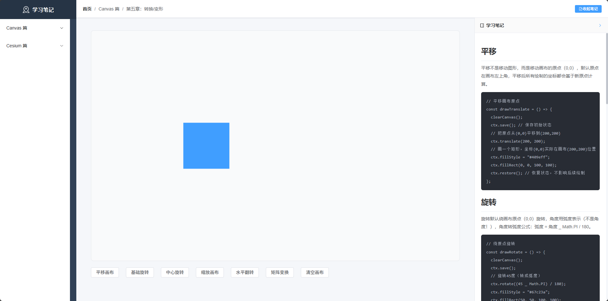
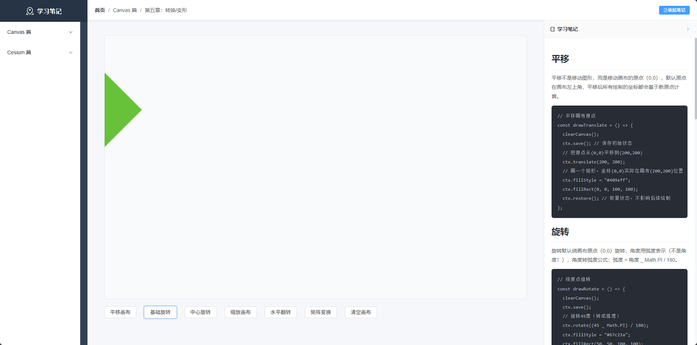
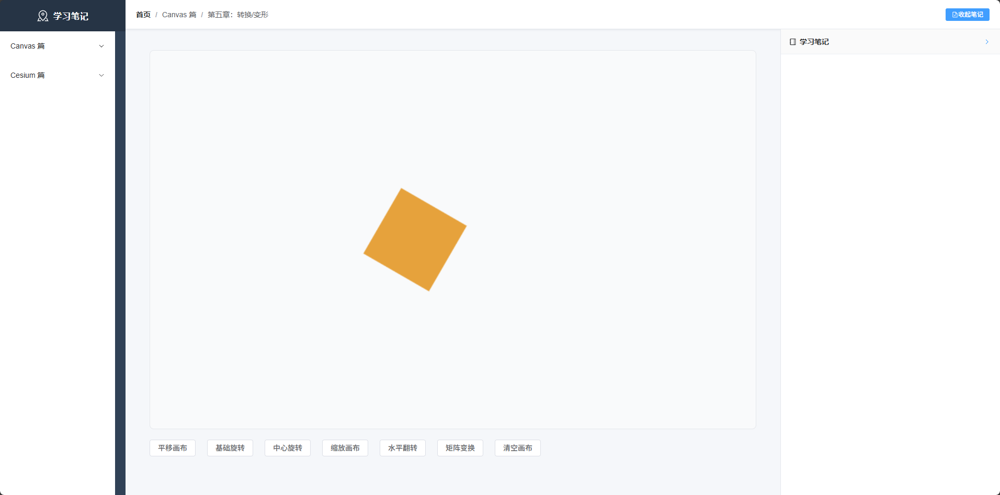
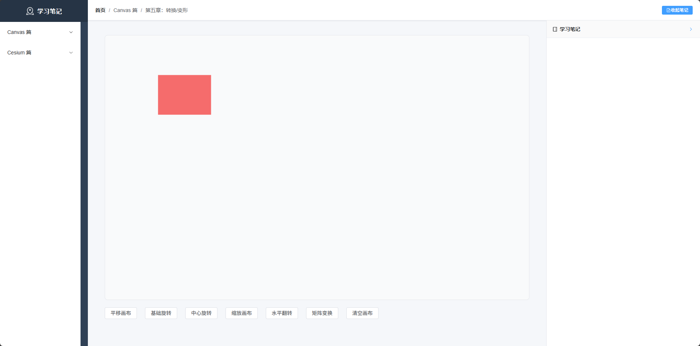
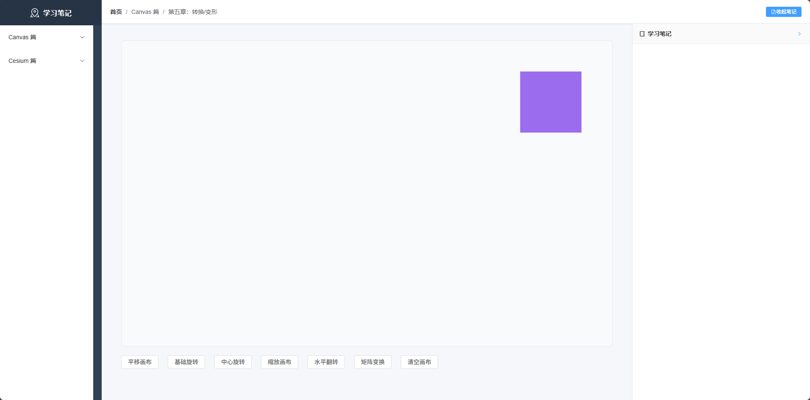
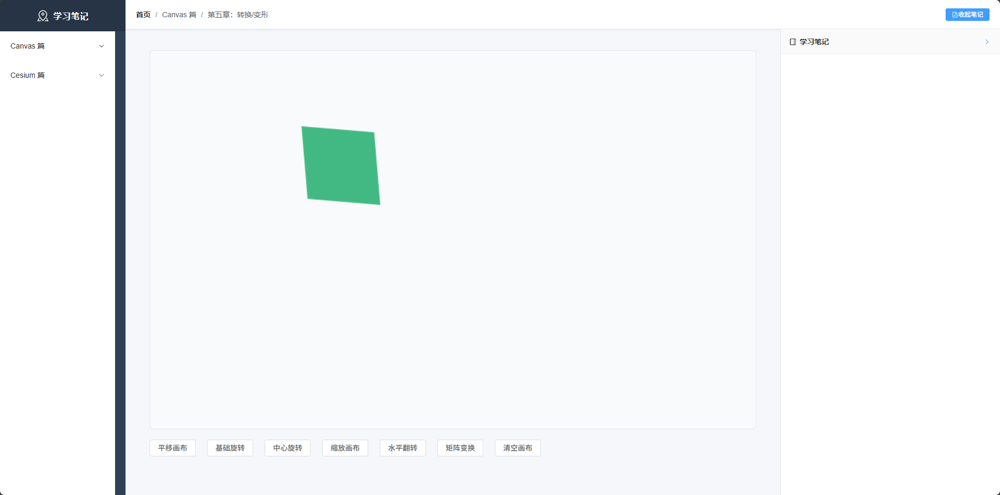

# 平移

平移不是移动图形，而是移动画布的原点（0,0），默认原点在画布左上角，平移后所有绘制的坐标都会基于新原点计算。

```js
// 平移画布原点
const drawTranslate = () => {
  clearCanvas();
  ctx.save(); // 保存初始状态
  // 把原点从(0,0)平移到(200,200)
  ctx.translate(200, 200);
  // 画一个矩形，坐标(0,0)实际在画布(200,200)位置
  ctx.fillStyle = "#409eff";
  ctx.fillRect(0, 0, 100, 100);
  ctx.restore(); // 恢复状态，不影响后续绘制
};
```



# 旋转

旋转默认绕画布原点（0,0）旋转，角度用弧度表示（不是角度！），角度转弧度公式：弧度 = 角度 \_ Math.PI / 180。

```js
// 绕原点旋转
const drawRotate = () => {
  clearCanvas();
  ctx.save();
  // 旋转45度（转成弧度）
  ctx.rotate((45 _ Math.PI) / 180);
  ctx.fillStyle = "#67c23a";
  ctx.fillRect(50, 50, 100, 100);
  ctx.restore();
};
```



# 绕中心旋转

想让图形绕自身中心旋转，必须按这个顺序：平移到中心 → 旋转 → 平移回原位，这是固定套路，直接抄就行。

```js
// 绕图形中心旋转
const drawRotateCenter = () => {
  clearCanvas();
  const x = 300; // 矩形初始x
  const y = 200; // 矩形初始y
  const w = 100; // 矩形宽
  const h = 100; // 矩形高

  ctx.save();
  // 第一步：平移到矩形中心
  ctx.translate(x + w / 2, y + h / 2);
  // 第二步：旋转30度
  ctx.rotate((30 \* Math.PI) / 180);
  // 第三步：平移回原位，再画矩形（坐标改为(-w/2, -h/2)）
  ctx.translate(-x - w / 2, -y - h / 2);
  // 绘制矩形
  ctx.fillStyle = "#e6a23c";
  ctx.fillRect(x, y, w, h);
  ctx.restore();
};
```



# 缩放

缩放画布的 x 轴和 y 轴，参数是缩放比例（1 = 原尺寸，>1 放大，<1 缩小，负数 = 翻转）。缩放后图形的坐标、尺寸都会按比例变化。

## 基础缩放

```js
// 缩放画布
const drawScale = () => {
  clearCanvas();
  ctx.save();
  // x轴放大2倍，y轴放大1.5倍
  ctx.scale(2, 1.5);
  ctx.fillStyle = "#f56c6c";
  ctx.fillRect(50, 50, 50, 50);
  ctx.restore();
};
```



## 翻转（缩放负数）

用负数缩放可以实现水平 / 垂直翻转，比如 scale(-1,1) 水平翻转，scale(1,-1) 垂直翻转。

```js
// 水平翻转画布
const drawScaleFlip = () => {
  clearCanvas();
  ctx.save();
  // 水平翻转（x轴缩放-1），需要先平移，否则翻转后会超出画布
  ctx.translate(canvasRef.value.width, 0);
  ctx.scale(-1, 1);
  ctx.fillStyle = "#9c6cef";
  ctx.fillRect(50, 50, 100, 100);
  ctx.restore();
};
```



# 矩阵变换（transform/setTransform）

所有平移、旋转、缩放最终都会转换成矩阵变换

ctx.transform(a, b, c, d, e, f)：在当前变换基础上叠加矩阵
ctx.setTransform(a, b, c, d, e, f)：重置所有变换，直接设置新矩阵（更安全）

参数含义
a：x 轴缩放
b：x 轴倾斜
c：y 轴倾斜
d：y 轴缩放
e：x 轴平移
f：y 轴平移

```js
// 矩阵变换（平移+缩放+倾斜）
const drawTransform = () => {
  clearCanvas();
  ctx.save();
  // 直接设置矩阵：x缩放1.2，y缩放1.2，x平移200，y平移100，加一点倾斜
  ctx.setTransform(1.2, 0.1, 0.1, 1.2, 200, 100);
  ctx.fillStyle = "#42b983";
  ctx.fillRect(0, 0, 80, 80);
  ctx.restore();
};
```


