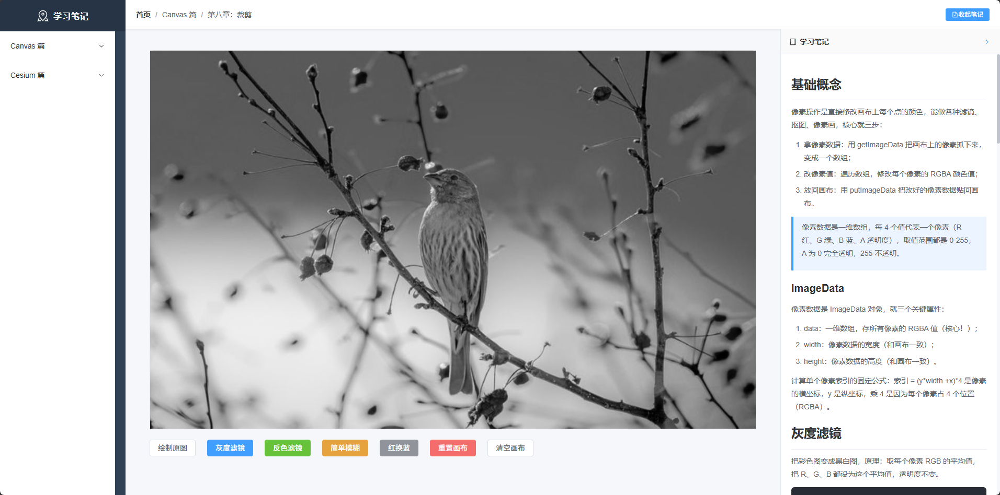
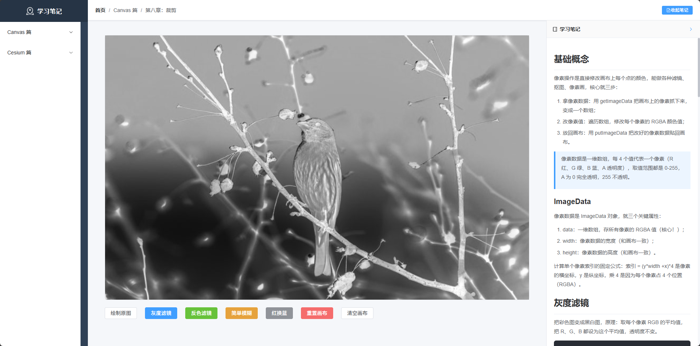
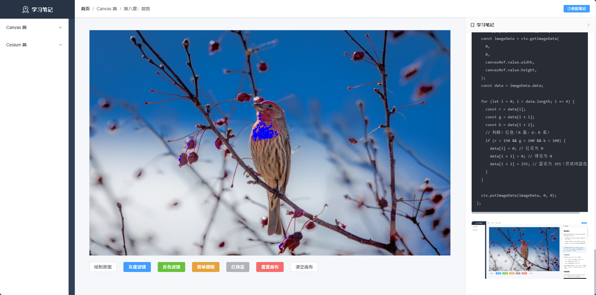

# 基础概念

像素操作是直接修改画布上每个点的颜色，能做各种滤镜、抠图、像素画，核心就三步：

1. 拿像素数据：用 getImageData 把画布上的像素抓下来，变成一个数组；
2. 改像素值：遍历数组，修改每个像素的 RGBA 颜色值；
3. 放回画布：用 putImageData 把改好的像素数据贴回画布。

> 像素数据是一维数组，每 4 个值代表一个像素（R 红、G 绿、B 蓝、A 透明度），取值范围都是 0-255，A 为 0 完全透明，255 不透明。

## ImageData

像素数据是 ImageData 对象，就三个关键属性：

1. data：一维数组，存所有像素的 RGBA 值（核心！）；
2. width：像素数据的宽度（和画布一致）；
3. height：像素数据的高度（和画布一致）。

计算单个像素索引的固定公式：索引 = (y*width +x)*4 是像素的横坐标，y 是纵坐标，乘 4 是因为每个像素占 4 个位置（RGBA）。

# 灰度滤镜

把彩色图变成黑白图，原理：取每个像素 RGB 的平均值，把 R、G、B 都设为这个平均值，透明度不变。

```js
// 灰度滤镜
const applyGray = () => {
  // 1. 拿画布的像素数据
  const imageData = ctx.getImageData(
    0,
    0,
    canvasRef.value.width,
    canvasRef.value.height,
  );
  const data = imageData.data; // 像素数组

  // 2. 遍历每个像素，改颜色
  for (let i = 0; i < data.length; i += 4) {
    const r = data[i]; // 红
    const g = data[i + 1]; // 绿
    const b = data[i + 2]; // 蓝
    // 计算灰度平均值
    const gray = (r + g + b) / 3;
    // 把 RGB 都设为灰度值
    data[i] = data[i + 1] = data[i + 2] = gray;
  }

  // 3. 把改好的像素放回画布
  ctx.putImageData(imageData, 0, 0);
};
```



# 反色滤镜

原理：每个颜色值用 255 减去原值，比如红色 200 变成 55，绿色 100 变成 155，最终效果像照片底片。

```js
// 反色滤镜
const applyInvert = () => {
  const imageData = ctx.getImageData(
    0,
    0,
    canvasRef.value.width,
    canvasRef.value.height,
  );
  const data = imageData.data;

  for (let i = 0; i < data.length; i += 4) {
    data[i] = 255 - data[i]; // 红反色
    data[i + 1] = 255 - data[i + 1]; // 绿反色
    data[i + 2] = 255 - data[i + 2]; // 蓝反色
    // 透明度不变
  }

  ctx.putImageData(imageData, 0, 0);
};
```



# 模糊效果

原理：取当前像素和周围 8 个像素的颜色平均值，让颜色过渡更柔和，实现模糊。注意：边缘像素不处理，避免越界报错。

```js
// 简单模糊滤镜
const applyBlur = () => {
  const imageData = ctx.getImageData(
    0,
    0,
    canvasRef.value.width,
    canvasRef.value.height,
  );
  const data = imageData.data;
  const width = canvasRef.value.width;
  const height = canvasRef.value.height;

  // 复制一份原始数据（避免修改时覆盖原值）
  const tempData = new Uint8ClampedArray(data);

  // 遍历像素（跳过边缘，防止越界）
  for (let y = 1; y < height - 1; y++) {
    for (let x = 1; x < width - 1; x++) {
      const idx = (y * width + x) * 4;
      // 取当前像素和上下左右 8 个邻域像素的 RGB 总和
      let r = 0,
        g = 0,
        b = 0;
      for (let dy = -1; dy <= 1; dy++) {
        for (let dx = -1; dx <= 1; dx++) {
          const tempIdx = ((y + dy) * width + (x + dx)) * 4;
          r += tempData[tempIdx];
          g += tempData[tempIdx + 1];
          b += tempData[tempIdx + 2];
        }
      }
      // 取平均值（9 个像素）
      data[idx] = r / 9;
      data[idx + 1] = g / 9;
      data[idx + 2] = b / 9;
    }
  }

  ctx.putImageData(imageData, 0, 0);
};
```

# 颜色替换

原理：遍历像素，判断 RGB 范围，符合条件就改成目标颜色，比如把红色换成蓝色，适合简单抠图改色。

```js
// 颜色替换
const applyReplaceColor = () => {
  const imageData = ctx.getImageData(
    0,
    0,
    canvasRef.value.width,
    canvasRef.value.height,
  );
  const data = imageData.data;

  for (let i = 0; i < data.length; i += 4) {
    const r = data[i];
    const g = data[i + 1];
    const b = data[i + 2];
    // 判断：红色（R 高，G、B 低）
    if (r > 150 && g < 100 && b < 100) {
      data[i] = 0; // 红设为 0
      data[i + 1] = 0; // 绿设为 0
      data[i + 2] = 255; // 蓝设为 255（变成纯蓝色）
    }
  }

  ctx.putImageData(imageData, 0, 0);
};
```


